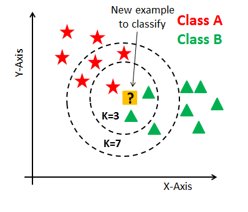
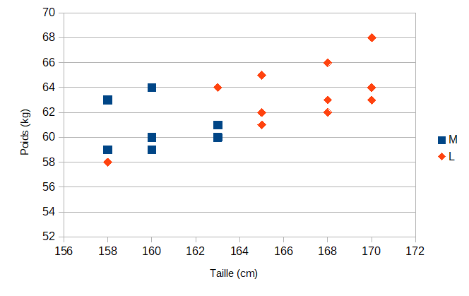
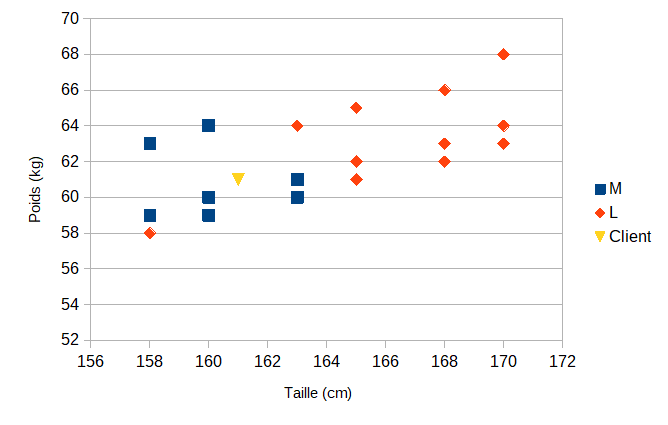
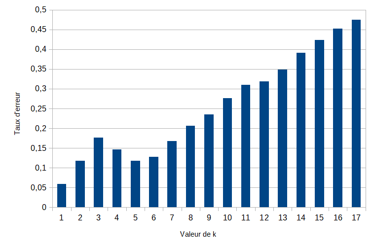
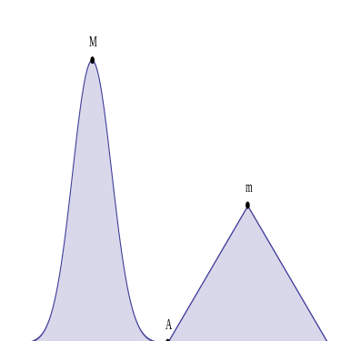
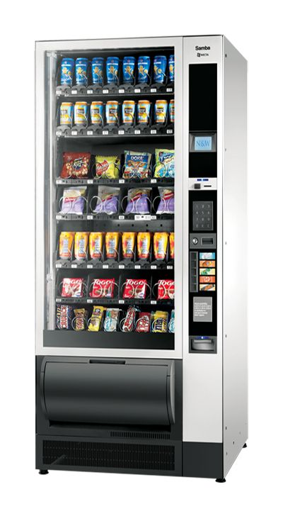

# Résolutions de problèmes complexes et intelligence artificielle

L'intelligence artificielle (IA), terme créé par John McCarthy, est "l'ensemble des théories et des techniques mises en œuvre en vue de réaliser des machines capables de simuler l'intelligence".

Elle correspond donc à un ensemble de concepts et de technologies plus qu'à une discipline autonome constituée. Souvent classée dans le groupe des sciences cognitives, elle fait appel à la neurobiologie computationnelle (particulièrement aux réseaux neuronaux), à la logique mathématique (partie des mathématiques et de la philosophie) et à l'informatique. Elle recherche des méthodes de résolution de problèmes à forte complexité logique ou algorithmique. Par extension elle désigne, dans le langage courant, les dispositifs imitant ou remplaçant l'homme dans certaines mises en œuvre de ses fonctions cognitives. Ces tâches sont pour l’instant accomplies de façon plus satisfaisante par des êtres humains car elles demandent des processus mentaux de haut niveau tels que : l’apprentissage perceptuel, l’organisation de la mémoire et le raisonnement critique. (Wikipedia)

En NSI les premiers algorithmes complexes étudiés sont l'algorithme des k plus proches voisins et les algorithmes gloutons.

## Algorithme des k plus proches voisins.

### 1. Présentation

https://medium.com/@kenzaharifi/bien-comprendre-lalgorithme-des-k-plus-proches-voisins-fonctionnement-et-impl%C3%A9mentation-sur-r-et-a66d2d372679

https://www.analyticsvidhya.com/blog/2018/08/k-nearest-neighbor-introduction-regression-python/

https://www.saedsayad.com/k_nearest_neighbors.htm

https://www.edureka.co/blog/k-nearest-neighbors-algorithm/

En abrégé k-NN ou KNN, de l'anglais k-nearest neighbors, c'est une méthode d’apprentissage automatique supervisé.

Le méthode consiste à mémoriser les observations selon des critères bien identifiés représentables dans un espace mathématique à plusieurs dimensions. Par exemple dans le cas d'observables à deux paramètres, X et Y, les objets peuvent être représentés sur un graphique comme ci-dessous.

Selon les valeurs de X et Y, deux ensembles distincts d'objets A et B apparaissent clairement.

Pour prédire la classe d’une nouvelle donnée dont les paramètres X et Y sont connus, l'algorithme va chercher ses K voisins les plus proches (en utilisant la distance euclidienne, ou autre) et choisira la classe des voisins majoritaires.

L'algorithme est qualifié comme "paresseux" (Lazy Learning) car il n’apprend rien pendant la phase d’entraînement.

La lecture du graphique permet de comprendre comment fonctionne la méthode. Pour $`\mathrm{K = 3}`$, l'algorithme va sélectionner la classe B pour la nouvelle donnée puisqu'elle est proche de deux objets de la classe B et un seul de la classe A. Ainsi, pour des entrées (X, Y) se situant dans les ensembles A ou B, la méthode donne de bons résultats. Par contre, lorsque qu'un couple (X, Y) se retrouve entre les ensembles, comme le cas présenté, la prise de décision est beaucoup moins évidente. En effet, pour $`\mathrm{K = 7}`$, l'algorithme désignera la classe A et non plus la B. Il va donc falloir étudier toutes les valeurs possible de K avant de le choisir judicieusement.

Ainsi, pour appliquer cette méthode, les étapes à suivre sont les suivantes :

* On fixe le nombre de voisins K.
* On détecte les K-voisins les plus proches des nouvelles données d’entrée que l’on veut classer.
* On attribue les classes correspondantes par vote majoritaire.

La méthode repose donc sur le choix judicieux de la valeur de K. Il est possible d'estimer la meilleure valeur grâce à des calculs de taux d'erreurs sur des échantillons tests :

* On fait varier K
* Pour chaque valeur de K, on calcule le taux d’erreur de l’ensemble du test
* On garde le paramètre K qui minimise ce taux d’erreur test.

Enfin le calcul de la distance entre voisins est un élément clé de la méthode. Trois formules sont souvent utilisées pour évaluer la distance entre deux données de coordonnées $`\mathrm{(x_1,y_1)}`$ et $`\mathrm{(x_2,y_2)}`$.

* La distance Euclidienne : $`\mathrm{distance = \sqrt{(x_2 - x_1)^2 + (y_2 - y_1)^2}}`$

* La distance de Manhattan : $`\mathrm{distance = |x_2 - x_1| + |y_2 - y_1|}`$

* La distance de Tchebychev : $`\mathrm{distance = max (|x_2 - x_1|, |y_2 - y_1|)}`$

### 2. Un exemple

Comme premier exemple une entreprise de prêt à porter souhaite prédire la taille d'un T-Shirt à partir des données taille et poids du client.

Pour cela des essayages ont été faits sur une échantillon de 18 personnes. Il est donné dans le fichier [csv](echantillon_taille_t_shirt.csv) à télécharger.

1\. Ouvrir le fichier avec un tableur et afficher les données dans un graphique comme ci-dessous.

2\. Vous semble-t-il possible de prédire la taille de T-Shirt d'un client à partir de ces données. Expliquer.

3\. Un client a une taille de 161 cm pour un poids de 61 kg. Ajouter son point représentatif sur le graphique. Quelle taille de T-Shirt lui semble adaptée ?

4\. Pour chaque objet de la collection, calculer la distance euclidienne entre le nouveau point et tous les autre points. Quelle formule avez-vous utilisée ?

5\. Classer les données par distance croissante et recenser les votes pour K allant de 1 à 5.

6\. En déduire la taille de T-shirt du client.

On va faire de même en Python.

7\. Importer le fichier CSV dans une variable `table`. Séparer les descripteurs des objets dans deux variables `liste_descripteurs` et `liste_objets`.

8\. Convertir les données numériques en entiers.

9\. Ecrire une fonction `distance_euclidienne(objet_1, objet_2)` qui calcule la distance euclidienne entre un objet `objet_1` et un autre objet `objet_2`. Ce sont des listes d'au moins deux valeurs entières, la taille puis le poids.

10\. Ecrire une fonction `calcule_distances(objet, liste_objets)` qui calcule toutes les distances euclidiennes entre un objet `objet` et tous les objets d'une liste d'objets `liste_objets`. La fonction retourne la liste d'objets à laquelle la distance a été ajoutée à la suite des valeurs des descripteurs de chacun des objets. L'objet test est `[161, 61]` pour 161 cm et 61 kg.

11\. Ecrire une fonction `compte_voisins(objet, liste_objets)` qui retourne le nombre de voisins de type M et de type L d'un objet pour chaque valeur de k. Le retour se fera sous la forme d'une liste de listes de deux éléments. Le résultat attendu pour l'objet test est :

`[[1, 0], [2, 0], [3, 0], [4, 0], [4, 1], [5, 1], [6, 1], [6, 2], [6, 3], [6, 4], [7, 4], [7, 5], [7, 6], [7, 7], [7, 8], [7, 9], [7, 10], [7, 11]]`

`[1, 0]` signifie que pour `k = 1`, on compte 1 M et 0 L.

`[2, 0]` signifie que pour `k = 2`, on compte 2 M et 0 L.

...

`[7, 11]` signifie que pour `k = 18`, on compte 7 M et 11 L.

12\. Ecrire une fonction `plus_proche_voisins(objet, liste_objets, k)` qui retourne la prédiction M ou L pour la valeur spécifiée de `k`.

13\. Que prédit la méthode pour l'objet test avec `k = 5` ?

Cette valeur de `k` n'a pas été choisie au hasard. Un test sur l'ensemble des données à permis d'obtenir le graphique ci-dessous donnant le taux d'erreur de la prédiction en fonction de `k`.

14\. Expliquer pourquoi choisir `k = 5`. Quelle est l'erreur commise sur la prédiction ?

## Algorithmes gloutons

### 1. Présentation

Résoudre un problème en science repose sur le principe de trouver toutes les solutions et sélectionner les meilleures d'entre elles. Toutefois, les problèmes peuvent être si complexes qu'il existe beaucoup trop de solutions et qu'il s'avère impossible de toutes les trouver dans un temps raisonnable. Quand bien même cela est possible, la recherche de toutes les solutions peut être fastidieuse si finalement, trouver une seule solution, même non optimale, est suffisant.

En informatique, un algorithme glouton (greedy algorithm en anglais, parfois appelé aussi algorithme gourmand) est un algorithme qui recherche une solution à un problème étape par étape, par choix successifs. A chaque étape une partie du problème trouve une partie de solution. Le problème restant à traiter est moins conséquent. Dans certains cas cette approche permet d'arriver à un optimum global, mais dans le cas général on obtient un optimum local. (Wikipedia)

Par exemple on envisage le graphique ci-dessous.

En partant du point A, l'algorithme doit trouver le maximum de la courbe. Un algorithme glouton va partir du point A et trouver le point suivant en suivant la pente la plus forte de la courbe. C'est effectivement la bonne méthode localement. Une pente plus forte se dirige vers un sommet plus haut. Toutefois, de proche en proche cette hypothèse oriente finalement l'algorithme vers le sommet m et non vers le sommet M.

### 2. Le problème du rendu de monnaie

Le problème du rendu de monnaie s'énonce de la façon suivante : étant donné un système de monnaie (pièces et billets), comment rendre une somme donnée de façon optimale, c'est-à-dire avec le nombre minimal de pièces et billets ?

Par exemple, la meilleure façon de rendre sept euros est de rendre un billet de cinq et une pièce de deux, même si d'autres façons existent, comme rendre sept pièces de un euro ou trois pièces de deux euros et une pièce de un euro.

Ce problème est difficile à résoudre dans le cas général. Cependant pour beaucoup de systèmes de monnaie, l'algorithme glouton est optimal. En effet il suffit de rendre systématiquement la pièce ou le billet de valeur maximale, tant qu'il reste quelque chose à rendre, pour obtenir la meilleure solution. En fait les systèmes de monnaie récents ont été choisis ou modifiés pour répondre efficacement à l'algorithme glouton.

Dans la zone euro, le système en vigueur est constitué des valeurs suivantes : 1, 2, 5, 10, 20, 50, 100, 200 et 500 euros et 1, 2, 5, 10, 20 et 50 centimes d'euros.

L'algorithme glouton, non récursif, du rendu de monnaie est le suivant :

1. Initialiser `somme_restante` à la valeur à rendre.

2. Sélectionner la devise de valeur immédiatement inférieure à `somme_restante`.

3. Déduire sa valeur de `somme_restante`.

4. Reprendre à l'étape 2 tant que `somme_restante` n'est pas nulle.

1\. Coder l'algorithme du rendu de monnaie dans une fonction `rendu_monnaie_euros(somme)`. La fonction retourne la liste des devises choisies pour le rendu de monnaie. On utilisera uniquement la liste des devises en euros, sans les centimes, `liste_valeurs = [1, 2, 5, 10, 20, 50, 100, 200, 500]`.

2\. Tester la fonction sur les sommes à rendre de 7 euros et 11 euros. Est-ce bien les solutions optimales ? Expliquer.

3\. Que donne l'algorithme avec la somme à rendre de 6 euros ?

4\. Même question mais les pièces 1, 2 et 5 euros sont remplacées par les pièces 1, 3 et 4 euros. La fonction s'appellera `rendu_monnaie_euros_modifiee(somme)`.

5\. La solution trouvée vous paraît-elle alors optimale ? Expliquer.

6\. Faire une autre fonction `rendu_monnaie(somme)` qui travaille cette fois-ci aussi avec les centimes.

7\. Quel est le rendu de monnaie sur les sommes : 57 centimes, 29 centimes, 3 euros et 2.59 euros ?

### 3. Le problème du sac à dos

En algorithmique, le problème du sac à dos, noté également KP (en anglais, Knapsack problem), modélise une situation analogue au remplissage d'un sac à dos, ne pouvant supporter plus d'un certain poids, avec tout ou partie d'un ensemble donné d'objets ayant chacun un poids et une valeur. Les objets mis dans le sac à dos doivent maximiser la valeur totale, sans dépasser le poids maximum.

Ce problème est l'un des 21 problèmes les plus difficiles en optimisation combinatoire repérés par Richard Karp dans son article de 1972. Il est intensivement étudié depuis le milieu du XXe siècle et on trouve des références dès 1897, dans un article de George Ballard Mathews. La formulation du problème est fort simple, mais sa résolution est plus complexe. Les algorithmes existants peuvent résoudre des instances pratiques de taille importante. Cependant, la structure singulière du problème, et le fait qu'il soit présent en tant que sous-problème d'autres problèmes plus généraux, en font un sujet de choix pour la recherche.

Ce problème est aussi à la base du premier algorithme de chiffrement asymétrique (ou à "clé publique") présenté par Martin Hellman, Ralph Merkle et Whitfield Diffie à l'université Stanford en 1976, permettant de crypter les données. Le chiffrement RSA a été publié l'année suivante. (Wikipedia)

Enfin on rencontre ce problème dans de nombreuses situations, celles exposées ci-dessus mais aussi dans les systèmes financiers (quels projets choisir pour qu'un certain montant d’investissement rapporte le plus d’argent possible),
pour la découpe de matériaux (minimiser les pertes dues aux chutes), dans le chargement de cargaisons (avions, camions, bateaux), ...

Afin d’illustrer ce type de problèmes que nous rencontrons souvent dans la vie courante, vous pouvez jouer au jeu ci-dessous. Le but est de remplir un sac à dos avec quatre types d’objets. Le nombre d’objets de chaque type mis à disposition dépend de la difficulté choisie. En mode deux joueurs, le gagnant sera celui qui aura rempli le sac sans dépasser la limite de poids maximum avec la plus grande valeur totale et le plus rapidement possible. (Interstices)

https://interstices.info/le-probleme-du-sac-a-dos/

Pour formaliser le problème du sac à dos, on envisage un sac à dos de poids maximal $`\mathrm{W_{max}}`$ et un ensemble de $`\mathrm{n}`$ objets. A chaque objet $`\mathrm{i}`$, sont associés un poids $`\mathrm{w_i}`$ en kg et une valeur $`\mathrm{v_i}`$ en euros.

Par exemple pour quatre objets, $`\mathrm{n = 4}`$, et un sac à dos d’un poids maximal de 30 kg, $`\mathrm{W_{max} = 30}`$, nous avons les données suivantes :

| Objets i                |  1 |  2 | 3  | 4  |
|:-----------------------:|:--:|:--:|:--:|:--:|
| poids $`\mathrm{p_i}`$  | 13 | 12 | 8  | 10 |
| valeur $`\mathrm{v_i}`$ | 7  | 4  | 3  | 3  |

1\. Trouver une solution de poids total égal au poids maximal, $`\mathrm{W = 30}`$. Quelle est sa valeur totale $`\mathrm{P}`$ ?

Ce n'est pas la meilleure solution. En effet il en existe au moins une autre, en ne considérant que les objets 1 et 2.

2\. Donner le poids et la valeur de cette deuxième solution.

Pour trouver la solution optimale, il faudrait énumérer toutes les possibilités et les évaluer.

3\. Combien de possibilités devrait-on traiter ? Expliquer.

L'algorithme glouton permet d'obtenir une solution correcte à ce problème rapidement. Dans notre cas la méthode est la suivante.

* calculer le rapport $`\mathrm{v_i / p_i}`$ pour chaque objet $`\mathrm{i}`$, grandeur qui représente la valeur par unité de masse

* trier tous les objets par ordre décroissant de cette grandeur

* sélectionner les objets un à un dans l’ordre du tri et ajouter l’objet sélectionné dans le sac si le poids maximal reste respecté

4\. Compléter le tableau ci-dessous.

| Objets i                |  0 |  1 | 2  | 3  |
|:-----------------------:|:--:|:--:|:--:|:--:|
| poids $`\mathrm{p_i}`$  | 13 | 12 | 8  | 10 |
| valeur $`\mathrm{v_i}`$ | 7  | 4  | 3  | 3  |
| rapport $`\mathrm{v_i / p_i}`$|

5\. Appliquer la suite de l'algorithme à la main. Quelle solution obtient-on ?

6\. Implémenter en python l'algorithme dans une fonction `sac_a_dos(liste_objets, masse_sac)`. Elle doit retourner la liste des indices des objets à mettre dans le sac.

7\. Implémenter une fonction `masse_valeur(liste_objets, liste_objets_dans_sac)` qui retourne la masse et la valeur du sac spécifié par `liste_objets_dans_sac`. C'est la liste des indices des objets se trouvant dans le sac. Vérifier ainsi que l'algorithme donne la même solution qu'à la question 5.

8\. Appliquer maintenant l'algorithme aux objets suivants. Le tableau sera complété au préalable.

| Objets i                |  0 |  1 | 2  | 3  |  4 |  5 | 6  | 7  |  8 |  9 |
|:-----------------------:|:--:|:--:|:--:|:--:|:--:|:--:|:--:|:--:|:--:|:--:|
| poids $`\mathrm{p_i}`$  | 13 | 12 | 8  | 10 |  8 | 15 | 1  | 1  |  9 | 3  |
| valeur $`\mathrm{v_i}`$ | 7  | 4  | 3  | 3  | 3  | 8  | 7  | 2  | 5  | 8  |
| rapport $`\mathrm{v_i / p_i}`$|

9\. Quelle est la solution obtenue ? Donner sa masse et sa valeur.

10\. La meilleure solution vous paraît-elle évident ?

11\. Combien de cas aurait du être étudiés pour trouver toutes les solutions au problème et choisir la meilleure ?

12\. Conclure sur l'utilité de la méthode glouton.
