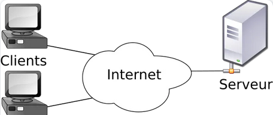
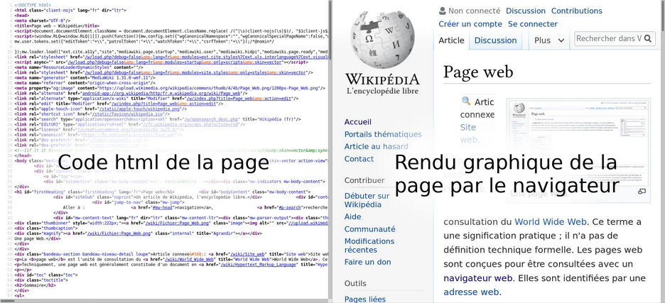

# Généralités sur le Web

## Programme

Lors de la navigation sur le Web, les internautes interagissent avec leur machine par le biais des pages Web.

La compréhension du dialogue client-serveur déjà abordé en classe de seconde est consolidée, sur des exemples simples, en identifiant les requêtes du client, les calculs puis les réponses du serveur traitées par le client.

On confond souvent Internet et le Web (ou « toile » en français). On trouve des choses sur Internet, on surfe sur le Web. Mais où est la différence ?  
Article de Laurent Viennot sur le site interstices.fr.

Le World Wide Web est une organisation à but non lucratif qui permet de normaliser le web afin qu'il soit accessible au plus grand nombre dans les mêmes conditions.

---

## Web et Internet : quelle différence ?

- **Le Web** (ou toile en français) est un ensemble d’informations reliées entre elles par des liens hypertextes.
- **Internet** est le réseau physique des ordinateurs reliés entre eux physiquement par des câbles, fibres optiques, ondes…

Le Web n’est qu’un service parmi d’autres utilisant Internet : mail, news, FTP…

---

## La naissance du Web

Le Web fut inventé en 1989 par Tim Berners-Lee et une équipe de recherches au CERN (Centre européen pour la Recherche Nucléaire).

C’est un système hypertexte qui permet de lier des documents par des hyperliens.

[video](https://pixees.fr/assistez-a-la-naissance-du-web-2/)

---

## L’architecture du Web

Le Web est possible grâce au réseau Internet qui relie entre eux les ordinateurs.

Certains ordinateurs hébergent des pages web : **les serveurs**.  
Chaque page web possède une adresse **URL (Uniform Resource Locator)**.

Chez vous, votre ordinateur — **le client** — peut demander qu’on lui transmette des pages web à partir de leur URL grâce au protocole **HTTP (HyperText Transfer Protocol)**.

L’architecture **client-serveur** est la plus répandue actuellement.

---

## Les langages du Web

### Côté client

Tous les navigateurs web (clients) utilisent trois langages :

- **HTML (HyperText Markup Language)** : contient le texte de la page et décrit ce texte afin qu’il puisse être compris par des programmes informatiques (navigateur web ou robots des moteurs de recherche).
- **CSS (Cascading Style Sheets)** : permet de mettre en forme la page web en modifiant les couleurs, polices…
- **JavaScript (JS)** : permet de rendre les pages web interactives, par exemple pour récupérer les données d’un utilisateur entrées dans un formulaire.

Leurs syntaxes et leurs possibilités ne cessent d’augmenter au fur et à mesure que nos usages d’Internet évoluent.

La fondation **W3C** a pour rôle de définir toutes les règles de ces langages (et d’autres) afin de maintenir le Web accessible à tous et ouvert.

---

### Côté serveur

Le navigateur du client peut envoyer des informations particulières au serveur par le biais du protocole HTTP.

Le serveur peut adapter la page envoyée à ses paramètres grâce à un langage de programmation côté serveur.  
Principalement **PHP (Hypertext Preprocessor)** aujourd’hui, mais tout langage peut être utilisé (Python, Ruby, NodeJS…).

---

## Rôle du navigateur

Le navigateur permet de traduire toutes les informations contenues dans les fichiers HTML, CSS et JS en un rendu qui s’affiche à l’écran avec lequel l’utilisateur peut interagir.

Pour afficher le code source d’une page, il suffit d’utiliser la combinaison :

CTRL + U

---

## Le développement d’une page Web

Avant de publier le site sur Internet, on commence par le développer localement sur son ordinateur avec deux logiciels :

### Un éditeur de code

Un simple éditeur de texte permet d’écrire le code HTML, CSS et JS.

Bien qu’un simple éditeur de texte suffise, on utilise plutôt des éditeurs de code dédiés à cet usage et qui permettent de :

- Colorer le code
- L’indenter
- Le vérifier
- L’auto-compléter

Exemples :

- Notepad++
- Atom
- Visual Studio Code
- Brackets

---

### Un navigateur web

Un navigateur permet de visualiser le rendu du code.  
Il doit être récent pour pouvoir développer un site en utilisant les dernières mises à jour des langages.

Exemples :

- Mozilla Firefox
- Google Chrome
- Microsoft Edge