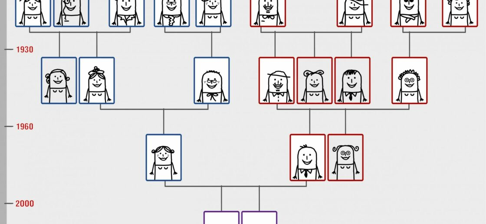
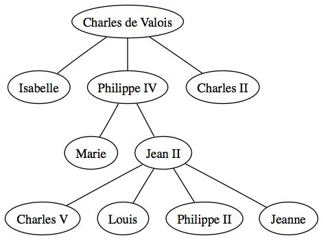

# Arbres (Structures de données)

## Introduction

Un **arbre** est une structure de données **hiérarchique** adaptée à la représentation de données comme :
- un arbre généalogique,

- l’arborescence d’un dossier,
- ou encore le DOM d’une page HTML

---

## 1. Vocabulaire

### **Arbre**
- Un **arbre** est constitué de **nœuds** reliés par des **arêtes**.
- Chaque nœud a généralement une **valeur** appelée **étiquette**.

### **Racine**
- La **racine** est le nœud principal d’un **arbre**, la racine n'a pas de **parent**.

### **Feuille**
- Une **feuille** est un nœud sans **descendants** (pas d’enfants).

### **Parent / Fils**
- Chaque nœud (sauf la racine) a **un seul parent**.
- Un nœud peut avoir plusieurs **fils**.

### **Profondeur**
- La **profondeur** d’un nœud est le nombre d’arêtes entre la **racine** et ce nœud.

### **Hauteur**
- La **hauteur** de l’arbre est la plus grande profondeur parmi toutes les feuilles.

### **Taille**
- La **taille** d’un arbre est le **nombre total de nœuds**.

### **Arité**

- L'**arité** d'un arbre est le nombre maximal de **fils** qu'un **noeud** peut avoir dans l'arbre.

### **Distance**

- La **distance** séparant 2 **noeuds** est le nombre d'arêtes traversées entre les 2.

 
 
 
 
 
 
 
 
 

## 2. Activité

Toutes les questions concernent l'arbre suivant:

1. Quel noeud est la racine de l'arbre ?
2. Quel est la taille de l'arbre ?
3. Combien d'arêtes sont comprises dans cet arbre ?
4. Donner la profondeur du noeud Jean II.
5. Qui sont les fils de Philippe IV ?
6. Donner toutes les feuilles de l'arbre.
7. Donner la hauteur de l'arbre, en considérant que la racine a une profondeur de 0.
8. Quel est l'arité de l'arbre ?
9. Qui est le parent de Marie ?
10. Quel est la distance entre Isabelle et Jeanne ?

