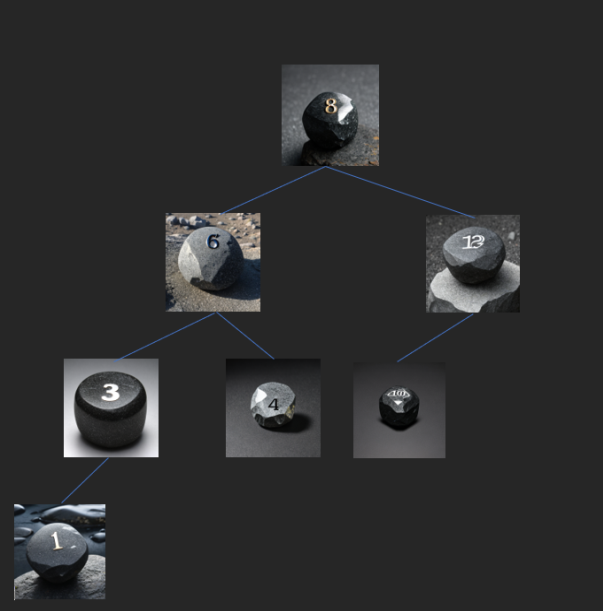

# Activité arbres binaires de recherche


## Introduction :

Vous êtes un(e) aventurièr(e) plongé(e) dans un monde fantastique où vous êtes en quête du Coffre d'Or, un mystérieux coffre légendaire caché quelque part dans une forêt magique. Pour atteindre leur objectif, ils doivent traverser la forêt magique rempli de choix entre 2 chemins. Guidé par les panneaux numérotés et le gardien de la forêt, vous devrez comprendre les secrets de la forêt pour atteindre le coffre le plus rapidement possible le gardien de la forêt vous donne le numéro de la pierre à côté du coffre à l'entrée de la forêt.\
A chaque intersection se trouve une pierre avec un numéro gravé dessus, les pierres sont rangés de manière à ce que tous les chemins forment un arbre binaire de recherche donc les pierres numérotés par un plus petit numéro seront toujours sur le chemin de gauche et inversement, il n'y a pas de chemin créant une boucle chaque pierre a 2 chemins avec un panneau indiquant le numéro sur la prochaine pierre.



## Exercices :

Importer le fichier [Foret.py](./Foret.py), vous n'avez pas besoin d'ouvrir ce fichier.

Dans un nouveau fichier nommé **Quete.py** dans le même dossier, importer le fichier **Foret.py** :

```python
from Foret import *
```

Dans ce dossier il y a une variable nommé FORET qui sera la foret dans laquelle vous êtes plongé pour trouver le Coffre d'Or.

Commencons votre aventure, dans votre shell vous aller agir sur la variable FORET, vos actions possibles sont la méthode **FORET.courant()** qui vous donne la valeur du caillou ou vous vous trouver et les méthodes **FORET.panneaux()** qui vous affiche les panneaux **FORET.avancer_droit()** qui vous fais avancer vers le chemin de droite et **FORET.avancer_gauche()** qui vous fais avancer vers le chemin de gauche.

Il n'y a pas de retour en arrière, si vous arriver à un cul de sac retourner au début en faisant :

```python
FORET = FORET_DEBUT
```

Ne modfiez pas la variable FORET_DEBUT

### Exercice 1 :

Q1) Atteignez le caillou annoncé par le sorcier dans votre shell en comptant le nombre de fois ou vous utiliser la méthode avancer_droit() ou avancer_gauche()\
Faites le 3 à 5 fois en rafraichissant votre fichier Quete.py et prenez la moyenne des comptes.

Dans le fichier **Foret.py**, il y a une 2ème forêt qui s'appelle FORET_2 qui a les mêmes méthodes, elles possèdent les mêmes numéros sur les cailloux mais il y a un détail en plus, cette forêt est un arbre binaire mais cette fois de recherche comme on l'a vu en cours.

Q2) Recommencez le processus de la question 1 avec la FORET_2 et comparez les 2 moyennes obtenues.

Q3) Ecrivez une fonction **recherche_arbre(arbre, valeur)** et **recherche_abr(arbre, valeur)** qui recherche respectivement dans un arbre binaire quelconque et un arbre binaire de recherche et renvoie Vrai si valeur est présente et Faux sinon.

Q4) Dans vos fonctions écrites précédemment, ajouter un compteur qui compte le nombre de déplacements effectués qui sera affiché à la fin de la recherche.

Q5) Depuis le fichier importé, vous pouvez trouver une variable VALEUR_RECHERCHEE,

Utiliser vos fonctions de recherche sur cette valeur, avec recherche_arbre sur FORET et recherche_abr sur FORET_2

Comparer les 2 compteurs affichés, répétez le processus plusieurs fois et en conclure quel foret est la plus clémente en moyenne pour trouver le Coffre d'Or.