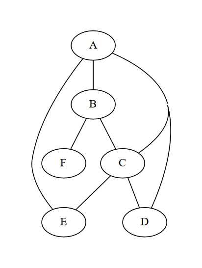

## IV. Parcours de graphes

### 1. Parcours en profondeur (DFS)

Le parcours en profondeur (ou "depth-first search" en anglais) est une méthode utilisée pour parcourir un graphe. Il s'agit d'une stratégie qui commence par un sommet racine, puis explore autant en profondeur que possible le long de chaque branche avant de passer à la branche suivante. C'est à dire qu'on explore les voisins des voisins d'abord.

1. On commence par choisir le sommet racine.
2. On met en mémoire, dans une pile, tout ses voisins accessibles ( successeurs ).
3. On choisit un de ces voisins et avance vers celui ci.
4. On revient au voisin stocké en haut de la pile mais pas encore visité. 
5. On répète les étapes 2, 3 et 4 jusqu'à ce que tout les sommets soient visités.

On peut voir un exemple étape par étape ici, [vidéo](https://youtu.be/7fujbpJ0LB4?t=80).

### 2. Parcours en largeur (BFS)

Le parcours en largeur (ou "breadth-first search" en anglais) est également une méthode utilisée pour parcourir un graphe. Il s'agit d'une stratégie qui commence par un sommet racine, puis explore toutes les branches partant de cette racine avant de passer au prochain sommet. C'est à dire qu'on explore tous les voisins de la racine avant d'avancer vers les autre sommets.

1. On commence par choisir le sommet racine.
2. On met en mémoire, dans une file cette fois, tout ses voisins accessibles ( successeurs ).
3. On choisit un de ces voisins et avance vers celui ci.
4. On visite ensuite prochain voisin dans la file mais pas encore visité. 
5. On répète les étapes 2, 3 et 4 jusqu'à ce que tout les sommets soient visités.

On peut voir un exemple étape par étape ici, [vidéo](https://youtu.be/oDqjPvD54Ss?t=49).

### 3. Recherche de la présence d'un chemin entre 2 sommets

Pour savoir si un chemin existe entre 2 sommets. Il suffit d'effectuer un parcours à partir du sommet de départ choisi et vérifier que le sommet d'arrivée est présent dans la liste des sommets parcourus.

Exemple:

Si un parcours nous donne la liste suivante avec **A** pour sommet de départ:

['A', 'B', 'D', 'E', 'F', 'H', 'G']

On peut dire qu'il existe un chemin entre **A** et **B**, entre **A** et **D**, etc.  
Mais pas entre **A** et **C**.

En python, on pourra utiliser un prédicat qui renvoies **Vrai** si il y a un chemin, **Faux** sinon.

### 4. Recherche de la présence d'un cycle dans un graphe

Pour savoir si un graphe contient un cycle. On utilise un parcours en profondeur.  
En avançant dans une branche, si on retombe sur un sommet déjà visité avant de devoir revenir en arrière, alors il existe au moins un cycle.

On rappelle qu'un cycle a **au minimum** une longueur de 3. On cherche donc une étape ayant une branche de longueur d'au moins 3 et ou un sommet visité, fait partie des voisins possibles, autre que le retour en arrière.\
Sur ce graphe, on peut par exemple faire le parcours en partant de **A**.

-  Branche : **A**  
Sommets Visités : [**A**]   
Voisins possibles : [**B**, **C**, **D**, **E**] 
Retour en arrière : .

-  Branche : **A** → **B**  
Sommets Visités : [**A**, **B**]   
Voisins possibles : [**A**, **C**, **F**] 
Retour en arrière : **A**

-  Branche : **A** → **B** → **F**  
Sommets Visités : [**A**, **B**, **F**]   
Voisins possibles : [**B**] 
Retour en arrière : **B**

Ici, tout les voisins possibles ont été visités, on revient donc au dernier sommet ou ce n'était pas le cas.

-  Branche : **A** → **B**  
Sommets Visités : [**A**, **B**, **F**]   
Voisins possibles : [**A**, **C**, **F**] 
Retour en arrière : **A**

-  Branche : **A** → **B** → **C**  
Sommets Visités : [**A**, **B**, **F**, **C**]   
Voisins possibles : [**A**, **B**, **D**, **E**]
Retour en arrière : **B** 

Ici, on voit que la branche est de longueur 3 et A se trouve dans les sommets visités et dans les voisins possibles sans être le retour en arrière, il y a donc un cycle **A** → **B** → **C** → **A**.