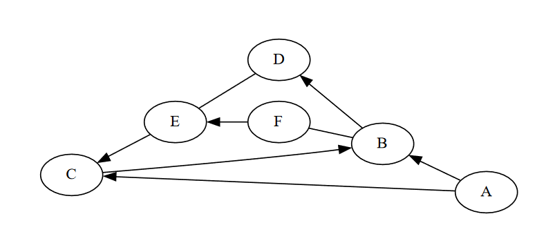

# TP : Compléter la classe Reseau pour gérer un réseau social

Dans ce TP, nous allons travailler sur la complétion de la classe `Reseau` trouvée dans ce fichier [Reseau](Reseau.py), qui représente un réseau social. La classe contient plusieurs méthodes pour gérer les utilisateurs et leurs relations dans le réseau. Votre tâche consiste à implémenter les différentes méthodes manquantes de la classe pour assurer le bon fonctionnement du réseau social.

Un réseau social se créer en donnant une liste d'utilisateurs et une liste de relations en paramètres du constructeur.

Le réseau social sera représenté par un graphe ou une arête représente une relation d'ami et un arc représente une demande en attente.

Exemple:

Le réseau suivant est définie par:

```python
reseau = Reseau([‘A’, ‘B’, ‘C’, ‘D’, ‘E’, ‘F’], [(‘A’, ‘B’), (‘A’, ‘C’), (‘C’,
   ‘B’), (‘B’, ‘D’), (‘B’, ‘F’), (‘F’, ‘B’), (‘D’, ‘E’), (‘E’, ‘D’), (‘F’,
   ‘E’), (‘E’, ‘C’)])
```

La méthode d'affichage est fournie, elle s'appelle `affiche`.




Dans ce réseau social, l'utilisateur A a demandé l'utilisateur B en ami mais n'a pas encore été accepté.  
Les utilisateurs D et E sont amis.
L'utilisateur E a été demandé par l'utilisateur F mais n'a pas accepté.


Pour tester vos résultats, vous pouvez reprendre le réseau fourni ou en créer un au choix.

<br/>
<br/>

### 1. Liste d'amis

Implémentez les méthodes suivantes :

   - `amis(self, user)`. Cette méthode doit renvoyer la liste des amis dde l'utilisateur `user`, ceux qui sont reliés par une arête avec cet utilisateur.

   - `ami_demande(self, user)` : Renvoie la liste des amis que l'utilisateur a demandés mais qui n'ont pas encore acceptés, ceux qui sont reliés par un arc sortant de `user`.

   - `demande_dami(self, user)` : Renvoie la liste des amis qui ont demandé l'utilisateur en ami mais qu'il n'a pas encore acceptés, ceux qui sont reliés par un arc entrant de `user`.

### 2. Recommandations d'amis.


Le PDG du réseau social vous demande de créer une fonctionnalité qui permet de recommander des amis aux utilisateurs.  
Pour ceci, on va chercher à avoir tout les amis des amis de l'utilisateurs.

Pour obtenir cette liste, on va utiliser les algorithmes de parcours vu en cours.

1. Implémentez les méthodes suivantes :
   - `parcours_profondeur(self, start)` : Effectue un parcours en profondeur du graphe à partir de l'utilisateur spécifié.
   - `parcours_largeur(self, start)` : Effectue un parcours en largeur du graphe à partir de l'utilisateur spécifié.
   - `possede_relation_commune(self, start, end)` : Recherche si l'utilisateur `end` et l'utilisateur `start` ont une suite d'amis en commun.

Vous pourriez potentiellement avoir besoin d'une file et/ou d'une pile qui sont fournies ici. [Pile](Pile.py). [File](File.py).

2. Le réseau ne peut afficher que 10 recommandations à la fois.

On vous demande donc de remplir la méthode `recommandations(self, user)` qui renvoies 10 des recommandations les plus proche de `user` possible.