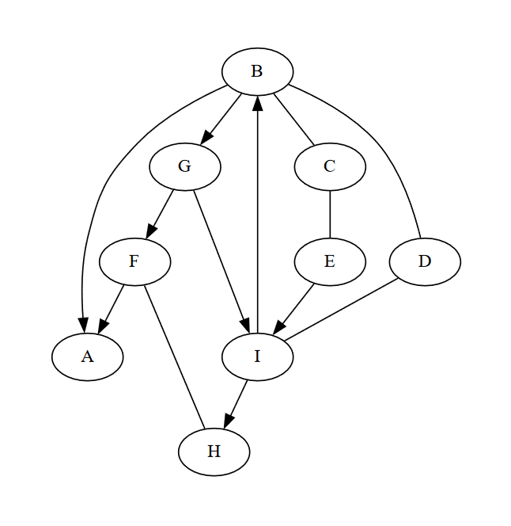
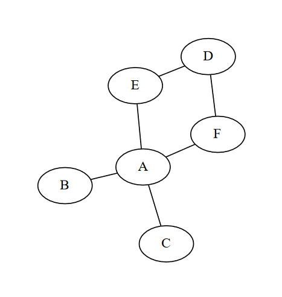

# TD Algorithmes sur les graphes

### Exercice 1 : Parcours à la main

1. Représenter graphiquement le graphe suivant.

{  
    'A' : [ 'B', 'C', 'D' ],  
    'B' : [ 'A', 'D' ],  
    'C' : [ 'A', 'D', 'E' ],  
    'D' : [ 'A', 'B', 'C', 'E', 'F' ],  
    'E' : [ 'C', 'D', 'F' ],  
    'F': [ 'D', 'E' ],  
}

2. Donner une liste obtenue par un parcours en largeur de ce graphe en partant du sommet **A**.

3. Donner une liste obtenue par un parcours en profondeur de ce graphe en partant du sommet **D**.

### Exercice 2 : Graphes orientés

1. A partir du graphe suivant, déterminer si il existe un chemin entre D et A, donner un exemple de chemin si il existe.  
Déterminer si il existe un chemin entre F et D, donner un exemple de chemin si il existe.



2. Réaliser un parcours en largeur à partir du sommet D.  
   Réaliser un parcours en profondeur à partir du sommet F.

3. Utiliser les réponses de la question précédente pour appuyer votre réponse à la question 1.

### Exercice 3 : Détail des parcours



1. En utilisant les étapes énoncées dans le cours, détailler les 2 parcours possibles en partant du sommet **A**, on notera bien à chaque étape le sommet courant, les sommets déjà visités et les voisins possibles à visiter.  
   Ecrire la liste de voisins possibles à visiter dans l'ordre dans lequel vous aller les visiter. On placera à gauche celui visité le prochain et à droite celui visité en dernier.

2. Pour les 2 parcours détaillés, quelle structure de données serait plus efficace pour stocker les voisins à visiter.

### Exercice 4 : Arbre couvrant d’un graphe

Un **arbre couvrant** est un sous-ensemble d’un graphe non orienté qui :

- contient **tous les sommets** du graphe,
- est **connexe** (on peut aller d’un sommet à un autre),
- **ne contient aucun cycle** (pas de boucle),
- contient exactement $n - 1$ arêtes si le graphe a $n$ sommets.

On peut voir l’arbre couvrant comme une sorte de **"squelette" minimal** du graphe, permettant de tout relier sans redondance.

---

#### 1. Représentation du graphe

On considère le graphe non orienté suivant :

```python
{
    'A': ['B', 'C'],
    'B': ['A', 'C', 'D'],
    'C': ['A', 'B', 'D', 'E'],
    'D': ['B', 'C', 'E', 'F'],
    'E': ['C', 'D', 'F'],
    'F': ['D', 'E']
}
```

1. Représenter ce graphe sous forme de dessin.  
2. Combien d’arêtes contient ce graphe ?  
3. Combien un **arbre couvrant** de ce graphe doit-il contenir d’arêtes ?
4. Peut-il y avoir plusieurs arbres couvrants pour un même graphe ? Pourquoi ?


#### 2. Construction d’un arbre couvrant

1. À partir du sommet **A**, construire un arbre couvrant en utilisant un **parcours en largeur** ou **en profondeur**.  
2. À chaque étape, noter :
   - Le sommet actuel
   - Les sommets déjà visités
   - Les arêtes ajoutées à l’arbre

#### 3. Variantes

1. Proposer un **autre arbre couvrant**, différent du précédent.  
2. Quels sont les sommets communs et les arêtes différentes entre vos deux solutions ?  