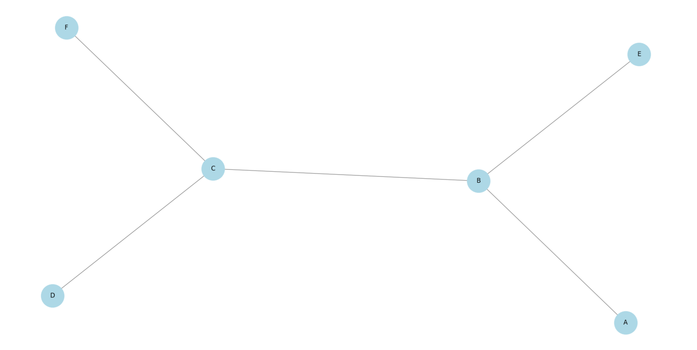
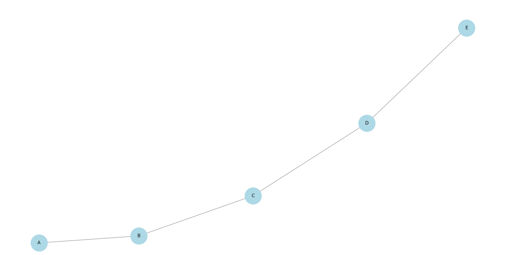
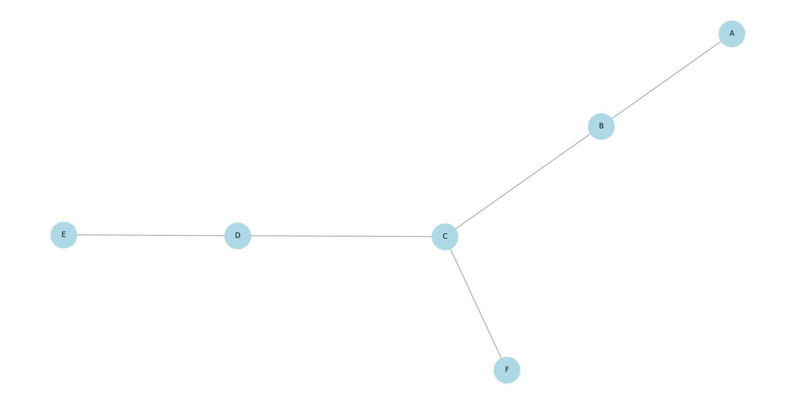
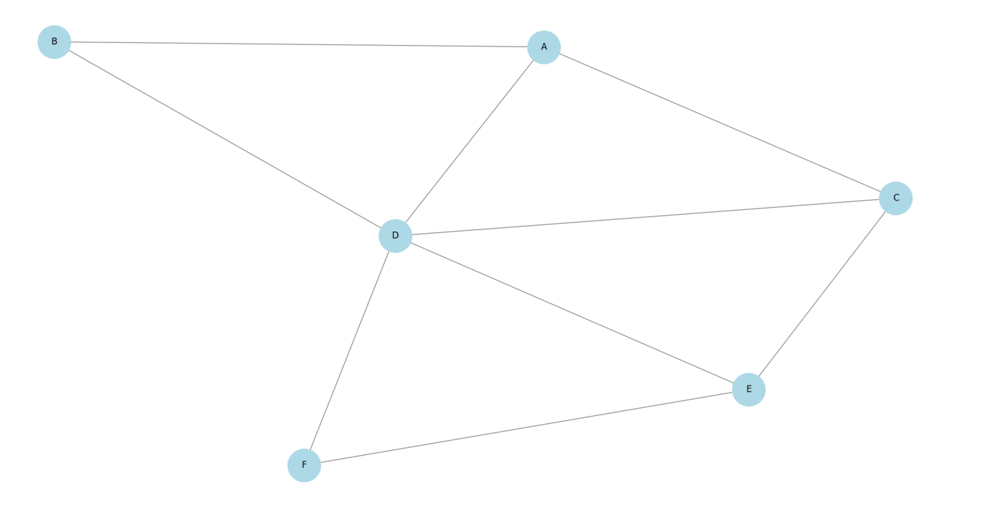
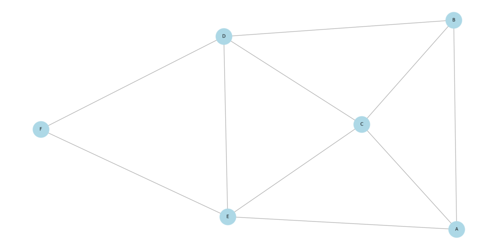
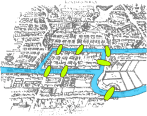
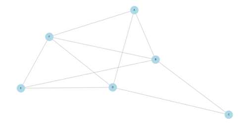

# Définitions

### Distance entre deux sommets

La distance $d(u,v)$  entre deux sommets $u$ et $v$ d’un graphe est la longueur du plus court chemin reliant ces deux sommets.

### Chaîne et Chemin

Une chaîne entre deux sommets $u$ et $v$ est une suite de sommets $u = v_0 , v_1, ... , v_k = v$ où chaque paire $(v_i,v_{i+1})$ est une arête du graphe.

Un chemin est une chaîne dont tous les sommets sont distincts.

 
 

### Excentricité

L’excentricité d’un sommet $v$, notée $e(v)$, est la distance maximale entre $v$ et un autre sommet du graphe :
$e(v) = max( d(v,u)) , u\in V$

### Rayon et Diamètre

Le rayon d’un graphe $G$ est la plus petite excentricité parmi tous les sommets :  $r(G) = min(e(v)), v\in V$

Le diamètre d’un graphe $G$ est la plus grande distance entre deux sommets :  $D(G) = max(d(u,v)), u,v\in V$

### Centre d’un graphe

Le centre d’un graphe est l’ensemble des sommets dont l’excentricité est minimale.

 

### Graphe eulérien

Un graphe est eulérien s’il possède un circuit eulérien, c'est-à-dire un cycle passant une seule fois par chaque arête du graphe.

### Graphe hamiltonien

Un graphe est hamiltonien s’il possède un cycle hamiltonien, c’est-à-dire un cycle passant une seule fois par chaque sommet du graphe.

