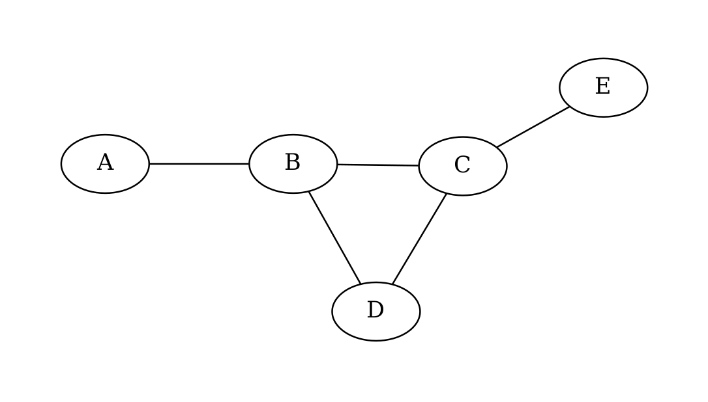
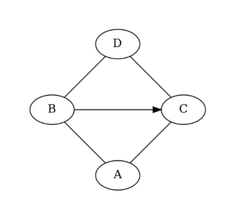
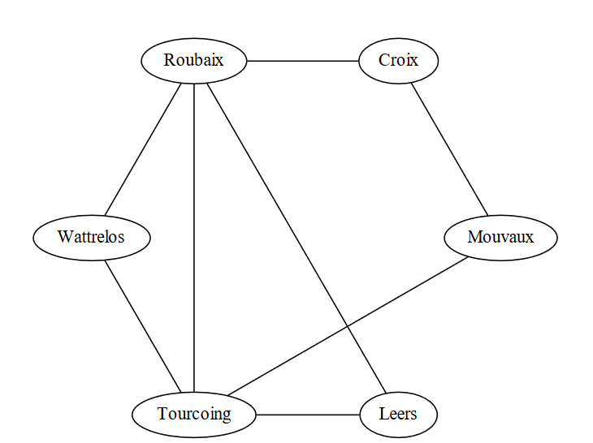
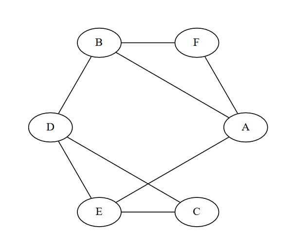
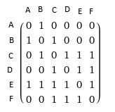
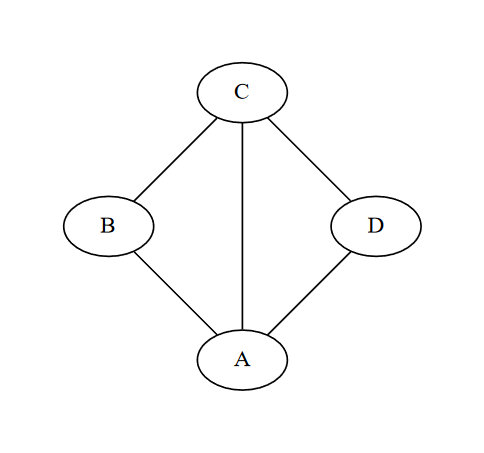
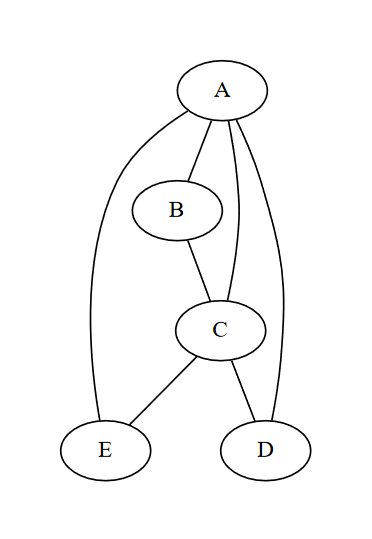
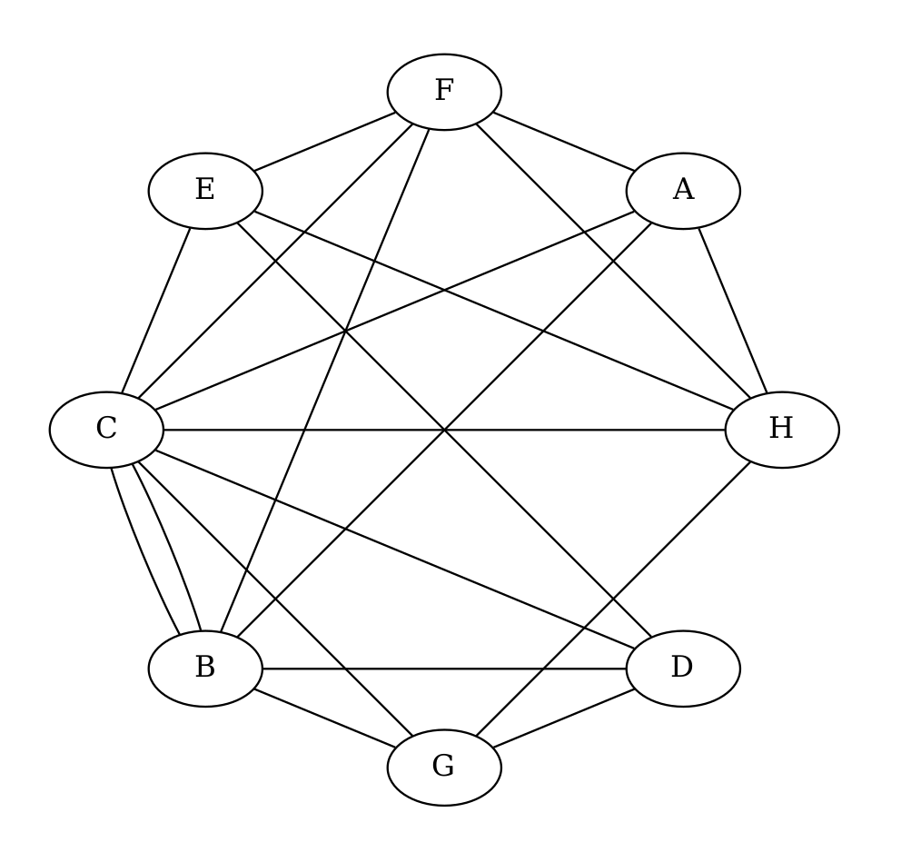

### **Exercice 1 : Notions de bases**

1. Pour les 2 graphes suivants, identifier les sommets, les arêtes et les arcs. Indiquer si le graphe est orienté ou non.

2. Pour le graphe 1, indiquer le degré du sommet B. du sommet E.
3. Pour le graphe 2, indiquer le degré entrant du sommet C et son degré sortant. Pour le sommet B.

Graphe 1:


Graphe 2:  
 

### **Exercice 2 : Interêt des graphes orientés**

Trouver une situation de la vraie vie ou les graphes orientés ont un interêt, on cherche à trouver quelque chose qui nécessite de fermer un ou plusieurs sens des arcs du graphe.

Si vous ne trouvez pas regarder la première phrase du cours, il ya des exemples qui peuvent être utiles.

### **Exercice 3 : Création de graphes**

1. Dessiner un graphe simple non orienté à 5 sommets et 6 arêtes.

2. Dessiner un graphe non simple à 2 sommets.
3. Dessiner un graphe quelconque d'ordre 3.
4. Dessiner un graphe complet non orienté à 4 sommets.\
Ce graphe est-il cyclique?
Calculer le degré de tous ses sommets, quelle est la particularité des degrés calculés?
5. Dessiner un graphe acyclique à 3 sommets.\
Dessiner un graphe orienté à 3 sommets qui est acyclique mais où tous les sommets sont reliés entre eux par un arc.
6. Dessiner un graphe avec 3 composantes connexes différentes.

### **Exercice 4 : Graphes pondérés**

Les routes possibles entre les villes suivantes ont été représentées sous forme d'un graphe.

On vous donne les distances suivantes:

Roubaix $\longleftrightarrow$ Tourcoing: 5 km\
Roubaix $\longleftrightarrow$ Wattrelos: 3 km\
Roubaix $\longleftrightarrow$ Croix: 6 km\
Roubaix $\longleftrightarrow$ Leers: 9 km\
Tourcoing $\longleftrightarrow$ Wattrelos: 3 km\
Tourcoing $\longleftrightarrow$ Leers: 10 km\
Tourcoing $\longleftrightarrow$ Mouvaux: 8 km



1. Remplir le graphe pour en faire un graphe pondéré par les distances fournies.

2. Le chef routier vous informe que la distance la plus courte entre Roubaix et Mouvaux est de 11 kilomètres. En déduire la distance manquante.

3. Trouver la distance la plus courte entre Wattrelos et Mouvaux (Vous indiquerez la distance totale et les villes parcourues).

4. Construire la liste d'adjacences de ces villes.\
Quelle ville permet d'accèder au plus grand nombre de villes différentes en 1 seul déplacement, quelle information sur le sommet permet de donner cette réponse.

<br/>
<br/>
<br/>
<br/>
<br/>
<br/>
<br/>
<br/>
<br/>
<br/>
<br/>
<br/>
<br/>


### **Exercice 5 : Listes et Matrices d'adjacences**

1. Construire la liste d'adjacences et la matrice d'adjacences de ce graphe.



2. A partir de cette liste de successeurs, construire le graphe orienté correspondant.

* A $\rightarrow$ [B, E]
* B $\rightarrow$ [C, D, F]
* C $\rightarrow$ [A, B]
* D $\rightarrow$ [A, E, F]
* E $\rightarrow$ [D]
* F $\rightarrow$ [B, D]


3. Construire la matrice d'adjacence associé à cette liste d'adjacence.

* A $\rightarrow$ [B, D]
* B $\rightarrow$ [A, C, D]
* C $\rightarrow$ [B]
* D $\rightarrow$ [A, B]

4. Construire la liste d'adjacence ou les listes de successeurs/prédécesseurs associés à cette matrice.


5. Construire le graphe associé à cette matrice.



### **Exercice 6 : Représentations en python à partir de liste d'adjacences**

1. En utilisant les notions abordés dans l'exercice précédent, créer une variable `graphe_1` qui représente ce graphe sous forme de liste d'adjacences.



2. Ecrire une boucle qui parcours cette variable et affiche le graphe de la manière suivante :


```python
Sommet A: Voisins ['B', 'C', 'D']
Sommet B: Voisins ['A', 'C']
Sommet C: Voisins ['A', 'B', 'C']
Sommet D: Voisins ['A', 'C']
```

2. Calculer le degré du sommet A et du sommet D à partir de la variable `graphe_1` :


3. A partir de la variable `graphe_2` fournie, déterminer si le graphe est orienté ou non.\
Si il l'est, on considérera cette variable comme les listes de successeurs du graphe.  
4. Determiner le degré entrant et sortant des sommets B et E :

```python
graph2 = {
    'A': ['B', 'C', 'E'],
    'B': ['C','E'],
    'C': ['A','D'],
    'D': ['A', 'C'],
    'E': ['B','D']
}
```

<br/>
<br/>
<br/>
<br/>
<br/>
<br/>
<br/>
<br/>
<br/>
<br/>
<br/>
<br/>
<br/>
<br/>
<br/>
<br/>
<br/>
<br/>

### **Exercice 7 : Représentations en python à partir de matrice d'adjacences**

1. Creer une variable `graphe_3` sous forme de matrices d'adjacences qui représente le graphe suivant. 



2. Ecrire une fonction qui permet de vérifier qu'une matrice est bien remplie pour représenter un graphe. ( Une matrice de graphe doit être carré ) avec la signature:

```python
def est_bien_remplie(mat : list[list[int]]) -> bool:
```

3. On a vu que pour un graphe simple, la diagonale de coordonnées (i, i) pour tout i inférieur à la taille de la matrice était remplie de 0.

Ecrire une fonction qui permet de le vérifier, on renverra vrai si elle est bien remplie de 0, faux sinon.

```python
def est_simple(mat: list[list[int]]) -> bool:
```

4. Un peu plus compliqué, écrire une fonction qui permet de savoir si un graphe est orienté ou non, on rappelle qu'un graphe non orienté est représenté par une matrice symétrique selon la diagonale évoquée à la question précédente.

La fonction renverra vrai si le graphe est orienté, faux sinon.

```python
def est_oriente(mat: list[list[int]]) -> bool:
```

### **Exercice 8 :**

1. Donner le degré des sommets A, C, G et H.

2. Trouver le(s) sommet(s) avec le(s) plus haut degré. Celui ou ceux avec le(s) plus petit degré.
3. Donner la matrice d'adjacence associé au graphe.

{:height="50%" width="50%"}

### **Exercice 9 :**

1. Dessiner le graphe associé à ce dictionnaire de listes d'adjacences:

{\
    'A' : ['B', 'E']\
    'B' : ['A', 'D']\
    'C' : ['D', 'E']\
    'D' : ['C']\
    'E' : ['A', 'C']\
    'F' : ['H']\
    'G' : []\
    'H' : ['F']\
}

2. Dessiner le graphe associé à cette matrice d'adjacences:

$\space\space\space\space\space$ A &nbsp; B &nbsp; C
 &nbsp; D
&nbsp; E
&nbsp; F\
A | 0 $\space$ 1 $\space$ 0 $\space$ 1 $\space$ 0 $\space$ 1\
B | 1 $\space$ 0 $\space$ 1 $\space$ 1 $\space$ 1 $\space$ 1\
C | 0 $\space$ 1 $\space$ 0 $\space$ 0 $\space$ 0 $\space$ 1\
D | 1 $\space$ 0 $\space$ 0 $\space$ 0 $\space$ 0 $\space$ 1\
E | 0 $\space$ 1 $\space$ 0 $\space$ 1 $\space$ 0 $\space$ 1\
F | 0 $\space$ 0 $\space$ 1 $\space$ 0 $\space$ 0 $\space$ 0

