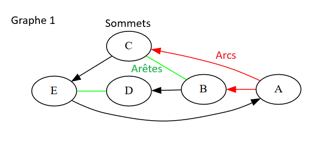
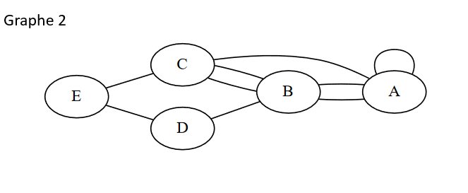
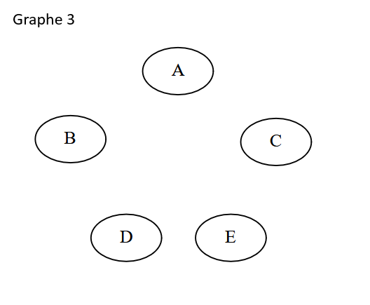
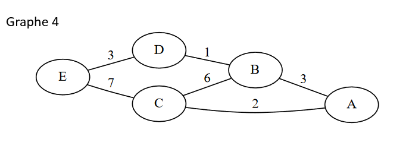
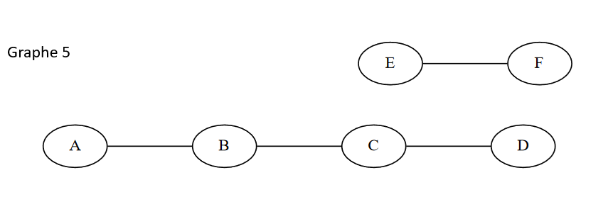
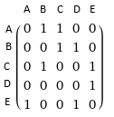

# Graphes

## Introduction

Un graphe est une structure relationnel. Il est composé de sommets (ou nœuds) et d'arêtes (ou arcs) qui relient ces sommets. Les graphes sont utilisés pour représenter et résoudre de nombreux problèmes dans divers domaines tels que la programmation, le réseau routier, la biologie, le réseau, etc.

## I. Définitions de base

### 1. Sommet et arête

- **Sommets (ou nœuds) :** ...................................................................................................................................................
- **Arêtes ou arcs:** ...............................................................................................................................................
- **Adjacence :** Deux sommets liés par une arête ou un arc sont dit **adjacents** ou **voisins**.

### 2. Graphe orienté et non orienté

- **Graphe orienté :** Les arêtes ont une direction, dans ce cas on les appelle **arcs**.
- **Graphe non orienté :** Les arêtes n'ont pas de direction.

Ce graphe est-il orienté ou non ?  
................................................................................................................................................................................................

### 3. Degré d'un sommet et ordre d'un graphe

- **Degré d'un sommet :** ............................................................................................................................................................................................
- **Degré entrant :** Nombre d'arêtes entrant dans un sommet, c'est à dire le nombre de sommets depuis lesquels on peut atteindre ce sommet. (seulement pour les graphes orientés).
- **Degré sortant :** Nombre d'arêtes sortant d'un sommet, c'est à dire le nombre de sommets qu'on peut atteindre à partir de ce sommet. (seulement pour les graphes orientés).
- **Ordre d'un Graphe :** .................................................................................................................................................

## II. Types de graphes

### 1. Graphe simple

- Pas d'arêtes multiples entre les mêmes sommets.
- Pas de boucles (arête reliant un sommet à lui-même).

### 2. Graphe complet

- Chaque paire de sommets est reliée par une arête.

### 3. Graphe pondéré

- Les arêtes ont des poids (valeurs numériques) associés.

Trouvez un exemple de la vie réelle ou les poids pourraient être utilisés:  
............................................................................................  
............................................................................................

### 4. Graphe cyclique et acyclique

- **Cycle :** Boucle formée par plusieurs sommets.
- **Graphe cyclique :** Contient au moins un cycle.
- **Graphe acyclique :** Ne contient pas de cycle.

### 5. Graphe et composante connexe

- **Composante connexe :** Ensemble de sommets pouvant tous être réliés par une ou plusieurs arêtes.
- **Graphe connexe :** Un graphe est dit connexe si il a une seule composante, elle-même connexe.
 
## III. Représentation des graphes

### 1. Liste d'adjacence

- A chaque sommet, on associe la liste de ses voisins.

Prenons l'exemple du Graphe 4, on obtient les listes:

* A : [B, C]
* B : [A, C, D]
* C : [A, B, E]
* D : [B, E]
* E : [C, D]

Pour un graphe orienté, On a besoin de 2 listes par sommet pour savoir le sens des arcs, une liste de **successeurs** ( Sommets atteignable depuis ce sommet ), et de **prédécesseurs** ( Sommets depuis lesquels ont peut atteindre ce sommet ) dans le cas du Graphe 1, on a:

**Listes des successeurs :**
* A ..............................
* B ..............................
* C ..............................
* D ..............................
* E ..............................

### 2. Matrice d'adjacence

- Tableau à deux dimensions ( Matrice ) où `M[i][j]` indique s'il y a une arête entre les sommets `i` et `j`, on trouvera un 0 à ces coordonnées si il n'y a pas de lien, et 1 si il y en a un.

On peut voir que la diagonale de la matrice est le lien entre un sommet et lui même donc aucun n'est à 1.  
Pour un graphe non orienté, la matrice serait symétrique le long de cette diagonale.