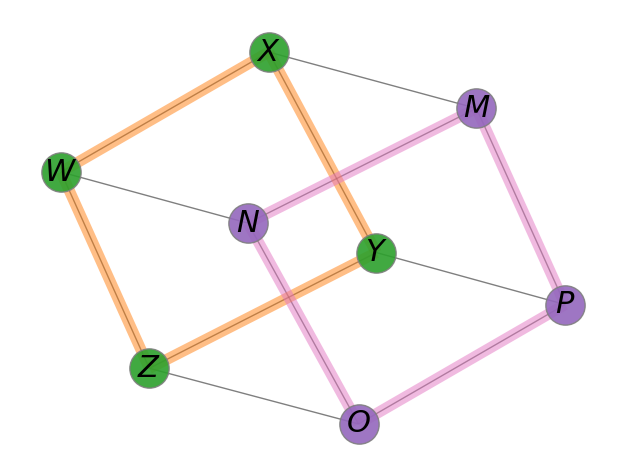

# TP d'Initiation au Module Graphviz avec Python

## Objectif
L'objectif de ce TP est de modéliser visuellement des graphes avec le module graphviz.


## Exercice 1: Création d'un graphe simple

1. Importez le module Graphviz dans votre script Python dont voici la documentation [Doc](https://graphviz.readthedocs.io/en/stable/manual.html).

>[!NOTE]
> ```import graphviz as gv```

Pour créer un graphe avec graphviz, on utilise le constructeur `gv.Graph` pour créer un graphe non orienté par défaut ou `gv.Digraph` pour un graphe orienté.\
On peut ensuite créer les sommets séparément et les relier par la suite avec des arêtes ou des graphes, ou créer directement les liens entre les 2 sommets, les sommets seront créer automatiquement si un nouveau nom apparait dans un lien.

>[!CAUTION]
> Avec graphviz :\
> arête ou arc : edge\
> sommet : node

2. Créez un graphe simple avec trois nœuds et deux arêtes.
3. Affichez le graphe généré.

## Exercice 2: Personnalisation du graphe

On peut ajouter des attributs dans les sommets et les liens pour ajouter des couleurs, des pondérations, changer la forme des sommets ou des arêtes, etc.

>[!CAUTION]
> forme : shape\
> couleur : color\
> attribut : attributes\
> pondération : label

Vous trouverez les noms des formes des sommets possibles ici [formes](https://graphviz.org/doc/info/shapes.html). les attributs de liens ici [arêtes](https://graphviz.org/docs/edges/) et les couleurs ici [couleurs](https://graphviz.org/doc/info/colors.html)

Reproduire le graphe suivant.


