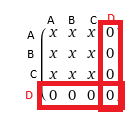

# TP de représentation de graphes en Python

Télécharger le fichier python [Graphe.py](src/Graphe.py). Vous y trouverez une classe Graphe à compléter au fur et à mesure de ce TP.

## Partie 1 : Création du graphe et opérations de base

Dans ce TP, nous choisirons d'utiliser principalement la représentation des graphes sous forme de matrice d'adjacences.

On aura une matrice sous forme de liste de listes et une liste de sommets à part pour éviter d'avoir une seule matrice legendée qui peut vite être compliquée à lire.

1. Compléter le constructeur de la classe pour que l'attribut `self.mat` soit une matrice de taille nb_sommets $\times$ nb_sommets remplie de 0.

On va donner un nom par défaut aux sommets du graphe, ici ils seront nommés 'A', 'B', 'C', ...\
Pour prendre le caractère 'A', on peut utiliser la fonction `chr(65)` ( 65 étant le code unicode du caractère 'A' ).

L'attribut `self.sommets` doit être une liste avec les lettres A, B , C, ... dans l'ordre jusqu'à ce qu'il y ait autant de lettre que nb_sommets.

Les codes unicode sont consécutifs donc B a pour code 66, C a 67, ...

2. Remplir la liste de `self.sommets` du bon nombre de lettre consécutives.

On chercher à avoir un affichage lisible de la matrice d'adjacence, c'est à dire ligne par ligne.

Exemple:

g = Graphe(5)

On veut afficher sa matrice comme ceci:

[0, 0, 0, 0, 0]\
[0, 0, 0, 0, 0]\
[0, 0, 0, 0, 0]\
[0, 0, 0, 0, 0]\
[0, 0, 0, 0, 0]

3. Compléter la méthode `afficher_matrice` pour qu'elle réalise cette affichage.

4. Compléter les méthode `get_matrice` et `get_sommets` qui renvoie respectivement les valeurs des attributs.

Comme vu en TD, on peut savoir si un graphe est orienté à partir de sa matrice d'adjacence si celle-ci est symétrique par rapport à sa diagonale.

 
 

5. Réutiliser la fonction écrite en TD pour remplir la méthode `est_oriente`.

Puisque les noms des sommets et la matrice du graphe sont 2 informations séparés, on aura besoin de faire le lien entre les 2.  
Pour ceci, nous allons utiliser l'indice des sommets qui sera le même dans la matrice et dans la liste de sommets.

6. Compléter la fonction `indice_sommet` qui renvoie l'indice du sommet passé en paramètre.

## Partie 2 : Modifications du graphe

Pour ajouter un sommet dans un graphe, il faut le placer en fin de la liste des sommets et ajouter dans la matrice une nouvelle ligne et une nouvelle colonne correspondant à ce sommet.

Si je veux ajouter un sommet 'D' dans un graphe d'ordre 3 par exemple, j'ajouterai D à ma liste de sommets et une nouvelle ligne et colonne en fin de matrice.

1. Compléter la méthode `ajouter_sommet` permettant d'ajouter un sommet au graphe.

Pour supprimer, c'est le même processus, il faut bien supprimer toute la ligne et toute la colonne associé au sommet supprimé.

2. Compléter la méthode `supprimer_sommet`.

Il faut maintenant pouvoir relié tout ces sommets.

Pour "créer" un lien entre les sommets i et jdans un graphe, il suffit de passer la donnée matrice[i][j] à 1.  
Si on veut une arête il ne faut pas oublier de passer matrice[j][i] à 1 également.

3. Compléter la méthode `ajouter_lien`.

Pour supprimer un lien, c'est la même chose mais on passe la valeur à 0.

## Partie 3 : Recherche dans le graphe

Maintenant qu'on peut tout construire et modifier dans notre graphe, on va chercher à obtenir des informations plus spécifiques sur nos sommets et notre graphe.

On rappelle que dans une matrice d'adjacence, les lignes permettent de trouver les successeurs et les colonnes sont les prédécesseurs, en regardant simplement si le lien est à 0 ou 1.

1. Compléter la méthode `successeurs` qui renvoies la liste de tout les successeurs du sommet passé en argument.

2. Compléter la méthode `predecesseurs` qui renvoies la liste de tout les prédécesseurs du sommet passé en argument.

Les voisins d'un sommet sont ses successeurs et ses prédécesseurs réunis sans doublons.

3. Compléter la méthode `voisins` qui renvoies la liste des voisins du sommet.

Le degré d'un sommet est facilement déterminable si on connaît ses voisins, successeurs  et predecesseurs.

4. Compléter les 3 méthodes de degré en utilisant les méthodes des questions 1, 2 et 3.

## Partie 4 : Autre représentation et affichage

Si un graphe peut avoir plusieurs représentations différentes, elles représentent quand même toutes le même graphe.

Nous cherchons à obtenir l'autre représentation possible de notre graphe, c'est à dire les listes d'adjacences ou listes de successeurs. Nous prendrons uniquement la liste des successeurs puisqu'elle suffit à représenter un graphe.

1. Compléter la méthode `matrice_to_liste` qui renvoie la liste de successeurs associés au graphe.

Pour tester plus facilement tout nos résultats, on va visualiser nos graphes comme dans le TP précédent, on ne veut pas de double arêtes/arcs, regarder donc la documentation de l'attribut *concentrate* de graphviz.

2. En choissisant la représentation que vous voulez pour réaliser l'affichage, compléter la méthode `affiche_graphe` qui se terminera par un appel à `view` pour afficher le graphe.