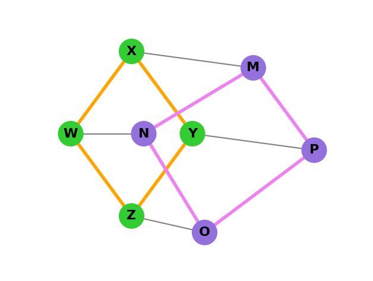

# TP d’initiation au module **NetworkX** avec Python

## Objectif

L’objectif de ce TP est de **modéliser, manipuler et afficher des graphes avec le module `networkx`** en Python.

## Exercice 1 : Création d’un graphe simple

### 1. Importer les modules nécessaires

Dans ce TP, on utilise :

* `networkx` pour créer et manipuler les graphes
* `matplotlib.pyplot` pour les afficher

```python
import networkx as nx
import matplotlib.pyplot as plt
```

### 2. Créer un graphe simple avec trois nœuds et deux arêtes

Avec `networkx` :

* un **sommet** = `node`
* une **arête** = `edge`

Pour créer un graphe non orienté :

```python
G = nx.Graph()
```

Pour créer un graphe orienté :

```python
G = nx.DiGraph()
```

Ajoutez ensuite trois nœuds et deux arêtes :

```python
import networkx as nx
import matplotlib.pyplot as plt

G = nx.Graph()

G.add_node("A")
G.add_node("B")
G.add_node("C")

G.add_edge("A", "B")
G.add_edge("B", "C")
```

### 3. Afficher le graphe généré

```python
nx.draw(G, with_labels=True)
plt.show()
```

### Travail demandé

1. Créez un graphe non orienté contenant les sommets `A`, `B`, `C`.
2. Ajoutez les arêtes `A-B` et `B-C`.
3. Affichez le graphe.

## Exercice 2 : Personnalisation du graphe

Avec `networkx`, on peut personnaliser :

* la **couleur des sommets**
* la **taille des sommets**
* la **couleur des arêtes**
* l’**épaisseur des arêtes**
* les **étiquettes** des arêtes

Contrairement à Graphviz, `networkx` s’appuie souvent sur `matplotlib` pour le rendu visuel.

<br>
<br>
<br>
<br>
<br>
<br>
<br>
<br>

### Exemple de personnalisation

```python
import networkx as nx
import matplotlib.pyplot as plt

G = nx.Graph()

G.add_edge("A", "B", label="5")
G.add_edge("B", "C", label="3")

pos = nx.spring_layout(G)

nx.draw(
    G, pos,
    with_labels=True,
    node_color="lightblue",
    node_size=2000,
    edge_color="gray",
    width=2
)

edge_labels = nx.get_edge_attributes(G, "label")
nx.draw_networkx_edge_labels(G, pos, edge_labels=edge_labels)

plt.show()
```

<br>
<br>
<br>
<br>
<br>
<br>
<br>
<br>
<br>
<br>
<br>
<br>
<br>
<br>
<br>
<br>
<br>
<br>
<br>


## Exercice 3 : Reproduire le graphe du TP avec NetworkX



### Travail demandé

Reproduisez ce graphe avec `networkx` en respectant :

1. les **sommets**
2. les **liaisons**
3. les **couleurs des sommets**
4. les **couleurs des arêtes**


## Exercice 4 : Ajouter des pondérations

Modifiez le graphe précédent en ajoutant des poids sur quelques arêtes.

Exemple :

```python
G.add_edge("W", "X", weight=2)
G.add_edge("X", "Y", weight=4)
```

Puis affichez les poids :

```python
edge_labels = nx.get_edge_attributes(G, "weight")
nx.draw_networkx_edge_labels(G, pos, edge_labels=edge_labels)
```

### Travail demandé

Ajoutez des pondérations aux arêtes de votre choix puis affichez-les.


## Exercice 5 : Graphe orienté

Créez maintenant une version orientée du graphe :

```python
G = nx.DiGraph()
```

Ajoutez quelques arcs, par exemple :

```python
G.add_edge("A", "B")
G.add_edge("B", "C")
G.add_edge("C", "A")
```

Affichez ensuite le graphe orienté.
