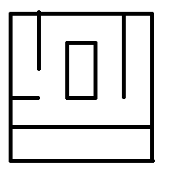
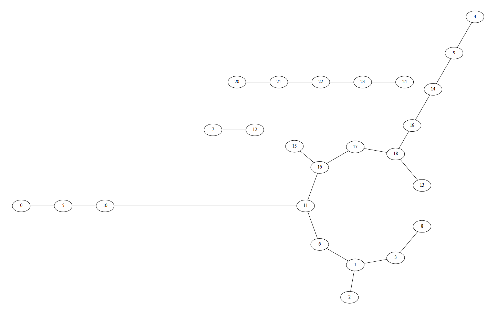
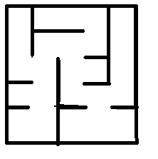
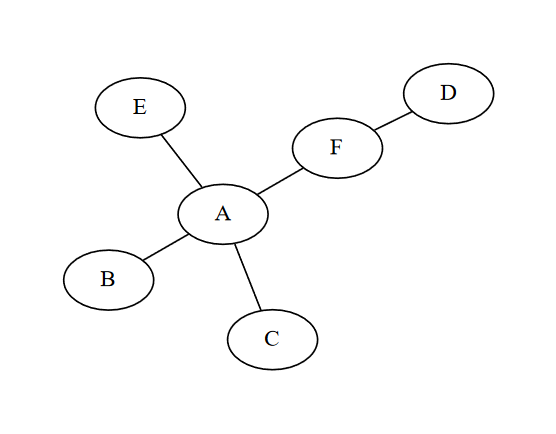

# TP résolution de labyrinthes.

Les labyrinthes peuvent être des casse-têtes plûtot dur a réaliser. Heureusement, Python peut nous aider.

Un labyrinthe peut être représenté sous forme d'un graphe et nous savons dire si il existe un chemin entre 2 sommets d'un graphe.

On utilisera la classe [Labyrinthe](Labyrinthe.py), qui modélise un labyrinthe carré sous forme de graphe en liste d'adjacences. 

Prenons pour exemple ce labyrinthe:

On numérote les cellules dans le sens de lecture classique et on peut obtenir le graphe suivant.

### Affichage du labyrinthe

Compléter la méthode `affiche_graphe` qui affiche le graphe correspondant à l'aide du module **graphviz**.

### 1 Création de passages

1. Compléter la méthode `casser_mur` qui permets de créer un passage enter cellule1 et cellule2.  
C'est à dire ajoute cellule1 en tant que voisins de cellule2 et inversement.

2. Compléter la méthode `casser_murs` qui permets de faire la même chose en prenant directement une liste de murs à casser sous la forme `(cellule1, cellule2)`.

### 2 Labyrinthes parfait, connexe et cyclique

Un labyrinthe est dit "**parfait**" si il ne contient aucun cycle et possède une seule composante connexe.

Par exemple, le premier labyrinthe montré ne l'est pas puisqu'on peut y voir un cycle et plusieurs composantes.

Un exemple de labyrinthe parfait de même taille pourrait être.

Ici, on voit qu'il n'y a aucun cycle et aucun "ilot", le labyrinthe est donc parfait.

1. La méthode `profondeur_cycle` utilise un parcours en profondeur mais au lieu de renvoyer la liste des sommets visités, on va renvoyer True si on trouve un cycle, False sinon. Il faudra donc mémoriser le parent du sommet_courant.  
Compléter cette méthode.

2. La méthode `est_cyclique` utilise la découverte d'un cycle vu juste avant pour savoir si un graphe est cyclique.

ATTENTION: si un parcours a partir d'un sommet ne contient pas de cycle, il peut y en avoir un en partant d'un autre sommet.

3. Pour savoir si un labyrinthe est connexe, il suffit de vérifier que le parcours renvoies le nombre de sommets total de son graphe. Puisqu'on connait les dimensions du labyrinthe, on peut en déduire son nombre de cellules.  
   Compléter `est_connexe`.

4. Comme expliqué, un labyrinthe est parfait si il est connexe et acyclique.  
   En utilisant les méthodes précédentes, remplir `est_parfait`

### 3 Résolution, chemin le plus court

Pour prouver l'existence d'un chemin entre 2 sommets, on sait qu'il faut utiliser un parcours, ici on chercher à retrouver le chemin le plus court possible.

Pour ce faire, on va modifier un parcours en largeur pour qu'il nous renvoie les parents des sommets parcourues.

Exemple:

Dans ce graphe, notre parcours modifié à partir de A nous renverrai :

{\
    'A': None # (ou ce que vous voulez qui ne pose pas d'incompréhension ),\
    'B': 'A',\
    'C': 'A',\
    'D': 'F',\
    'E': 'A',\
    'F': 'A'\
}

1. Ce parcours modifié s'appelle ici `chemin_largeur`, compléter cette methode.

2. A partir d'un dictionnaire de parent, on peut facilement faire le chemin à l'envers pour le retrouver, compléter `remonte_chemin` qui prends le résultat de votre parcours en paramètre et remonte le chemin de l'arrivée choisie vers le depart.

Pour tester vos résultats, décommenter les instructions en fin de document et agir sur laby1 et laby2.